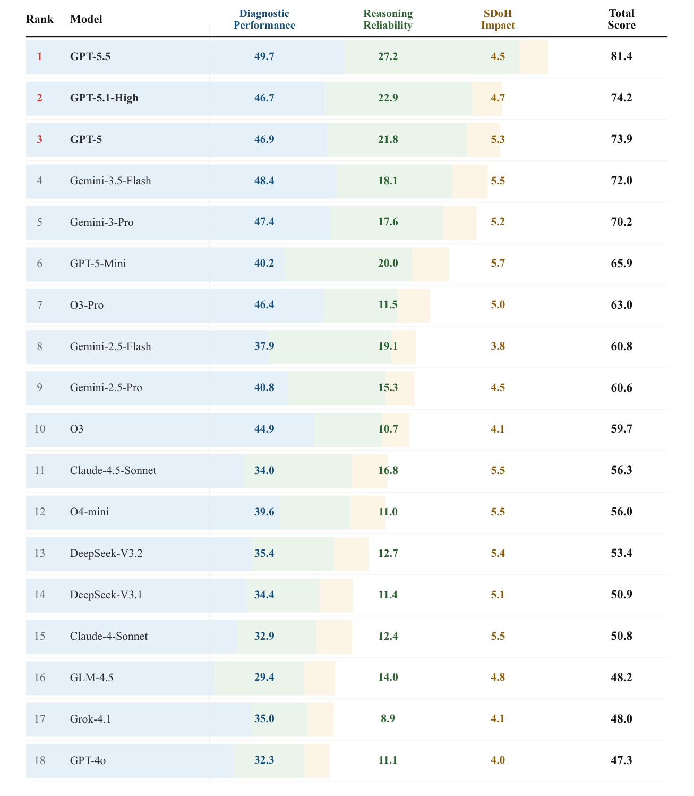
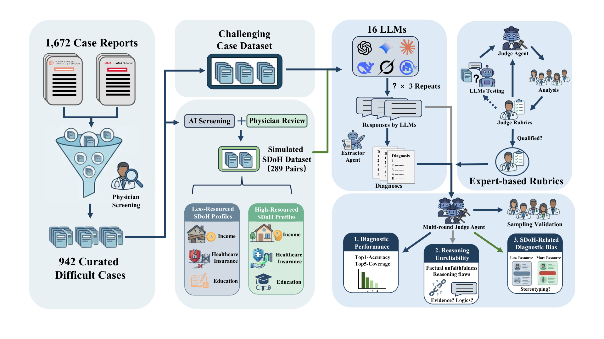

# PRISM-Med 基准测试

**语言：** [English](README.md) · [中文](README.zh-CN.md) · [Français](README.fr.md) · [Español](README.es.md)

**PRISM-Med 是一个面向大语言模型（LLM）与 AI 智能体（agent）的多维度综合评测基准**，聚焦复杂临床推理与诊断场景——不仅看单一准确率，而是通过多个互补维度系统评估医学 AI 在真实应用中的能力。

**PRISM-Med：面向复杂医学诊断场景的大语言模型多维度评测**

本仓库实现 **PRISM-Med** 基准：挑战性病例诊断、推理可靠性与社会健康决定因素（SDoH）偏倚等指标融合为综合得分（`Benchmark_Score_100`），便于在相同条件下对比不同模型与智能体流水线。

### 评测协议（参考运行）

公开排行榜与论文式得分采用统一的**三轮重复**规则：

1. **每例三轮独立重复** — 每个受试模型对同一批病例**重复作答三次**（轮次 id 为 `1_5answer`、`1_5answer_1`、`1_5answer_2`，见 `config/legacy_script_config.py`），挑战集与 SDoH 分支在适用时同样按三轮执行。
2. **诊断相关分类 → 多数投票** — 各轮由评判模型对照参考标准判定 Top-1 与鉴别诊断列表后，**在病例层面将三轮分类结果按多数票合并**（`classification_vote` 阶段）；第一支柱的准确率、覆盖率及相应得分输入均基于投票后的标签。
3. **推理内容分类 → 直接汇总** — 对推理缺陷的审核**不做投票**；**将三轮结果直接汇总**（各轮 flaw 分类一并纳入合并后的病例视图），第二支柱的严重推理缺陷率在该汇总结果上计算。

本地复现默认遵循上述设置；可通过 `PRISM_*` 环境变量调整轮次列表，详见 [docs/BENCHMARK.md](docs/BENCHMARK.md)。

我们会**持续更新**公开的**模型排行榜**，并在后续**逐步开源更多基准数据集**。请关注本仓库以获取更新的图表、`dataset/` 发布等。

下文所有命令均假设当前工作目录为**本仓库根目录**（包含 `run_prism_benchmark.py` 的文件夹）。

## 概览

### 模型排行榜（参考运行）

下图展示一次完整 PRISM-Med 评测的示例排名（可用下文流水线本地复现）。**该排行榜为快照**——随着更多模型完成评测，我们计划刷新排名；数据集覆盖范围也将在后续版本中扩展。

<p align="center">
  
</p>

<p align="center"><sub>高清矢量图：<a href="img/benchmark_scores.pdf">img/benchmark_scores.pdf</a></sub></p>

#### 已评测模型（参考运行）

上图汇总下列受试模型的 **PRISM-Med** 综合分（`Benchmark_Score_100`）。**版本**列为本基准使用的 API `model_id`（见 `model_config/model_config.example.json`）。

| LLM | 版本（API model id） | 公司 |
|-----|----------------------|------|
| Claude-4-Sonnet | `claude-sonnet-4-20250514` | Anthropic |
| Claude-4.5-Sonnet | `claude-sonnet-4-5-20250929` | Anthropic |
| DeepSeek-V3.1 | `deepseek-v3-1-250821` | DeepSeek |
| DeepSeek-V3.2 | `deepseek-v3.2-thinking` | DeepSeek |
| DeepSeek-V4 Pro | `deepseek-v4-pro` | DeepSeek |
| Gemini-2.5-Flash | `gemini-2.5-flash` | Google |
| Gemini-2.5-Pro | `gemini-2.5-pro` | Google |
| Gemini-3-Pro | `gemini-3-pro-preview` | Google |
| Gemini-3.5-Flash | `gemini-3.5-flash` | Google |
| GLM-4.5 | `glm-4.5` | Zhipu AI |
| GPT-4o | `gpt-4o-2024-11-20` | OpenAI |
| GPT-5 | `gpt-5-2025-08-07` | OpenAI |
| GPT-5-Mini | `gpt-5-mini-2025-08-07` | OpenAI |
| GPT-5.1-High | `gpt-5.1-high` | OpenAI |
| GPT-5.5 | `gpt-5.5` | OpenAI |
| Grok-4.1 | `grok-4.1` | xAI |
| O3 | `o3-2025-04-16` | OpenAI |
| O3-Pro | `o3-pro-2025-06-10` | OpenAI |
| O4-mini | `o4-mini-2025-04-16` | OpenAI |

本地默认受试模型列表见 `config/legacy_script_config.py`，可能仅为子集；可通过 `PRISM_*_MODELS` 或 `--models` 覆盖，详见 [docs/BENCHMARK.md](docs/BENCHMARK.md)。

### 基准流水线

三大支柱汇入综合分 `Benchmark_Score_100`。完整步骤：[docs/BENCHMARK.md](docs/BENCHMARK.md)。

<p align="center">
  
</p>

<p align="center"><sub>高清矢量图：<a href="img/flowchart.pdf">img/flowchart.pdf</a></sub></p>

**许可：** 本仓库**软件与文档**适用 [MIT License](LICENSE)。`dataset/` 中的**临床病例文本**仍受**原出版方版权**约束——见 [dataset/README.md](dataset/README.md)。可机读引用元数据：[CITATION.cff](CITATION.cff)。

## 引用

若使用本基准或代码，请引用：

> **PRISM-Med: multidimensional evaluation of large language models in complex medical diagnosis**  
> Xintian Yang¹*, Qin Su²*, Yukang Liu²*, Hui Luo², Xiangping Wang², Gui Ren², Xiaoyu Kang², Weijie Xue³, Yuemin Feng¹, Ben Wang¹, Qianqian Xu¹, Lei Shi¹, Qi Zhao¹, Shuhui Liang², Yong Lv², Yongzhan Nie², Lina Zhao⁴, Han Wang⁵‡, Yanglin Pan²‡, Hongwei Xu¹,⁶‡  
> *同等贡献。‡通讯作者。

BibTeX 示例（正式发表后请补充期刊/会议与 DOI）：

```bibtex
@article{yang2026prismmed,
  title   = {PRISM-Med: multidimensional evaluation of large language models in complex medical diagnosis},
  author  = {Yang, Xintian and Su, Qin and Liu, Yukang and Luo, Hui and Wang, Xiangping and Ren, Gui and Kang, Xiaoyu and Xue, Weijie and Feng, Yuemin and Wang, Ben and Xu, Qianqian and Shi, Lei and Zhao, Qi and Liang, Shuhui and Lv, Yong and Nie, Yongzhan and Zhao, Lina and Wang, Han and Pan, Yanglin and Xu, Hongwei},
  year    = {2026},
  note    = {Benchmark code and data: see repository README and CITATION.cff}
}
```

## 仓库内容

| 包含 | 不随仓库分发（本地生成） |
|------|--------------------------|
| `dataset/` 下病例列表与目录（完整模式 942 条挑战查询） | `benchmark/result/` 下的 LLM 输出 |
| 提示词（`prompt/`）、分类规则、偏倚参考表（`benchmark/reference_table_bias_with_doi.xlsx`） | `prism_benchmark/runs/` 下的运行清单 |
| 流水线代码（`stages/`、`lib/`、`prism_benchmark/`） | 流水线完成前的综合得分工作簿 |
| API 配置模板（`model_config/model_config.example.json`） | 完整**第三支柱**预处理树（`bias_analysis_*`，约 289 个病例文件夹）——见 [docs/BENCHMARK.md](docs/BENCHMARK.md) |

**临床数据：** 病例 vignette 通过 **DOI** 关联已发表的 **NEJM** / **JAMA** 等病例报告。再分发或复用病例文本前请阅读 [dataset/README.md](dataset/README.md)。

## 环境要求

- **Python 3.10+**
- 依赖安装：

```powershell
pip install -r requirements.txt
```

## 快速开始

以下命令在 **Windows PowerShell** 下从**仓库根目录**执行。Linux/macOS 请使用 `python3`、正斜杠路径，并用 `cp` 替代 `Copy-Item`。

1. **安装依赖**（见上文 [环境要求](#环境要求)）。

2. **配置 API**——复制模板并编辑 `model_config/model_config.json`：为计划运行的每个模型别名设置 `api_key` 与 `url`（id 需与[已评测模型](#已评测模型参考运行)表一致，如 `gpt-5.5`、`gemini-3.5-flash`）。

```powershell
Copy-Item .\model_config\model_config.example.json .\model_config\model_config.json
# 编辑 model_config\model_config.json（勿提交真实密钥）。
```

3. **预检（不调用 API）**——若尚无第三支柱 `bias_analysis_*` 数据（约 289 个病例文件夹），可对支柱 1–2 启用部分 SDoH：

```powershell
$env:PRISM_ALLOW_PARTIAL_SDOH = "1"
python .\run_prism_benchmark.py --check-only --no-pause
```

   退出码 `0` 表示当前模式下数据资产检查通过。详情：[docs/BENCHMARK.md](docs/BENCHMARK.md)。

4. **选择受试模型**——默认见 `config/legacy_script_config.py`（`DEFAULT_MODEL_LIST`）。可用环境变量覆盖（逗号分隔的**配置 id**）：

```powershell
$env:PRISM_BASE_ASK_MODELS = "gpt-5.5,gemini-3.5-flash"
$env:PRISM_BIAS_ASK_MODELS = "gpt-5.5,gemini-3.5-flash"
$env:PRISM_CLASSIFICATION_MODELS = "gpt-5.5,gemini-3.5-flash"
$env:PRISM_REASONING_MODELS = "gpt-5.5,gemini-3.5-flash"
$env:PRISM_REASONING_SUMMARY_MODELS = "gpt-5.5,gemini-3.5-flash"
$env:PRISM_COUNT_TARGET_MODELS = "gpt-5.5,gemini-3.5-flash"
```

   检查器/评判模型：在 `model_config.json` 中配置，并可设置 `PRISM_REASONING_LLM_MODEL`、`PRISM_COUNT_MODEL` 等（见 [docs/BENCHMARK.md](docs/BENCHMARK.md)）。

5. **完整三支柱得分（论文式）**——提供外部 `bias_analysis_*`（junction 或 `PRISM_BIAS_ANALYSIS_ROOT`），并在**未**设置 `PRISM_ALLOW_PARTIAL_SDOH` 时运行。将执行全部 12 步、探测 API，耗时长且可能产生 API 费用：

```powershell
Remove-Item Env:PRISM_ALLOW_PARTIAL_SDOH -ErrorAction SilentlyContinue
python .\run_prism_benchmark.py --no-pause
```

   **仅支柱 1–2：** 保持 `$env:PRISM_ALLOW_PARTIAL_SDOH = "1"` 或使用 `python .\run_prism_benchmark.py --allow-partial-sdoh --no-pause`。

6. **输出**（成功运行后）：

| 产物 | 路径 |
|------|------|
| 各阶段 LLM JSON/文本 | `benchmark/result/<model>/…` |
| 综合得分工作簿 | `benchmark/benchmark_scores_output.xlsx` |
| 运行清单 / 完成表 | `prism_benchmark/runs/` |

   重复执行同一命令可**续跑**未完成病例；随时可用 `--check-only` 查看阶段完成情况。

更多说明：[docs/BENCHMARK.md](docs/BENCHMARK.md) · [PROJECT_LAYOUT.md](PROJECT_LAYOUT.md)

## 常用命令（Windows PowerShell）

| 目标 | 命令 |
|------|------|
| 数据 / 三支柱检查 | `python .\run_prism_benchmark.py --check-only --no-pause`（见[快速开始](#快速开始)第 3 步） |
| 完整 12 步基准 | `python .\run_prism_benchmark.py --no-pause` 或双击 `run_prism_full_benchmark.bat` |
| 恢复完整查询与参考表 | `python .\prism_benchmark\scripts\prepare_full_benchmark_data.py` |
| 仅流水线编排 | `python .\prism_benchmark\scripts\run_pipeline.py --config .\prism_benchmark\configs\default.json` |

分步指南：[docs/BENCHMARK.md](docs/BENCHMARK.md) · 目录结构：[PROJECT_LAYOUT.md](PROJECT_LAYOUT.md) · 编排层：[prism_benchmark/README.md](prism_benchmark/README.md)

## 入口脚本

- `run_prism_benchmark.py` — 推荐启动器（预检、API 探测、12 步、完成表）
- `prism_benchmark/scripts/run_pipeline.py` — 配置驱动流水线（无启动器附加功能）
- `prism_benchmark/scripts/data_assets_check.py` — 三支柱资产检查（独立）
- `prism_benchmark/scripts/benchmark_verify.py` — 分步产物校验（`list_missing_cases.py` 封装此工具）
